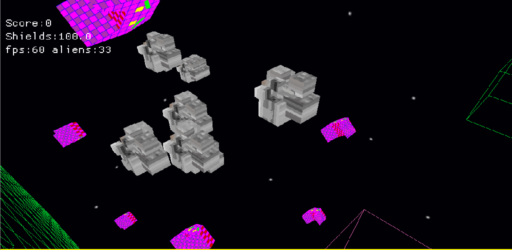

# dreg

This is a demo game when trying out library https://github.com/not-fl3/macroquad . Excellent library that takes care of cross platform issues for opengl amongst other things.




The android build is available on Google Play

https://play.google.com/store/apps/details?id=org.bjason.dreg

## some build info

The docker image should have everything needed to build for all platforms

```
docker pull bernardjason/cargo-apk
docker run -it --rm -v $(pwd)":/root/src" -w /root/src bernardjason/cargo-apk bash
```

then from docker prompt to build for android (debug)
```
cargo quad-apk build
```

The APK built is target/android-artifacts/debug/apk/dreg.apk. If you've got adb installed locally then to push to connected device
```
adb install target/android-artifacts/debug/apk/dreg.apk
```


windows 
```
cargo build --target x86_64-pc-windows-gnu
```

wasm
```
cargo build --target wasm32-unknown-unknown
cp src/index.html mq_js_bundle.js  assets/* target/wasm32-unknown-unknown/debug
```
once wasm built cd to target/wasm32-unknown-unknown/debug and server page with for example
```
python3 -m http.server
```


